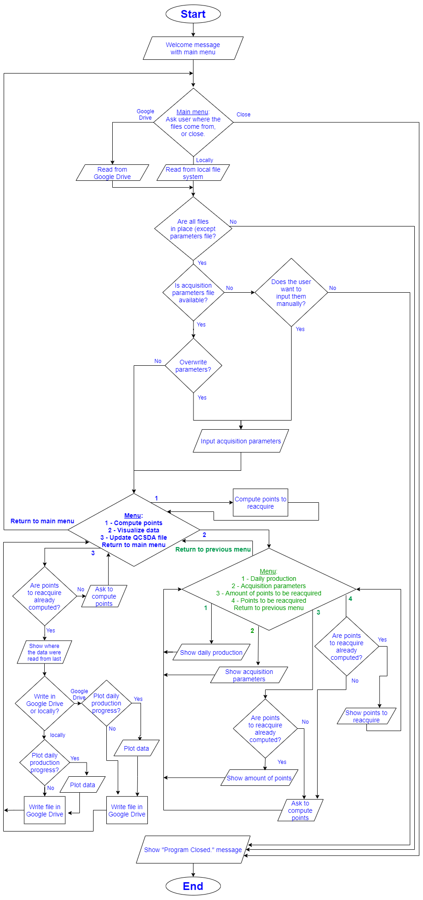
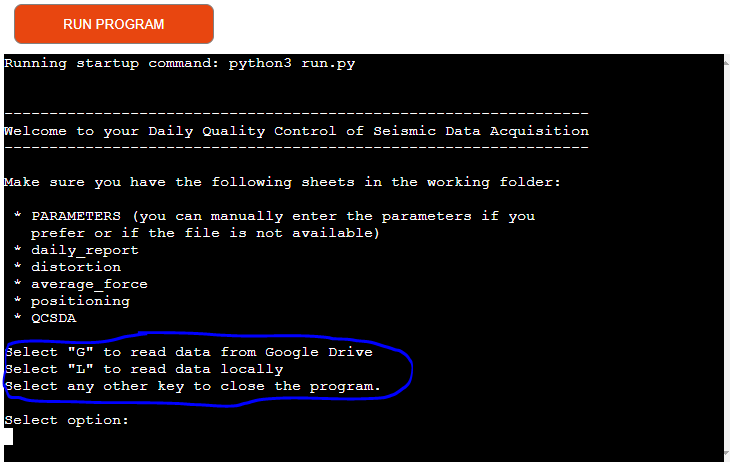
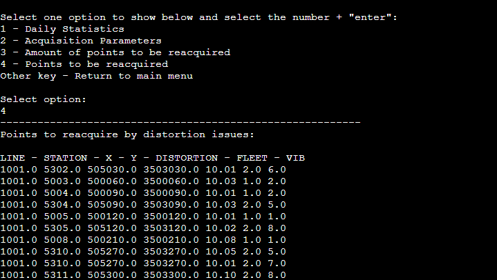
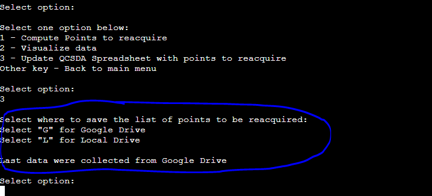
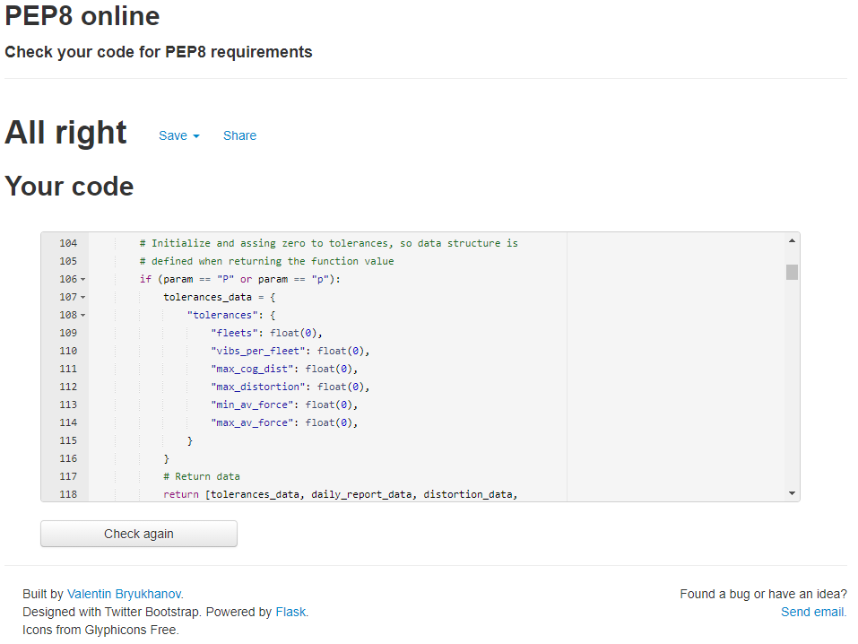

# Quality Control of Seismic Data Acquisition

This project aims for automation of quality control task of seismic data acquisition using the files generated for that purpose by the recorder instrument. Except for the content referenced in this README file and/or the code and/or the website, all content is invented by me, anything matching reality is just a coincidence.

This repository belongs to my third milestone project in the Full-stack Development course at Code Institute, covering Python along with Git version control and other software technologies.

The live link for this project is [**this one**](https://pp3-ci-qcsda.herokuapp.com/) (https://pp3-ci-qcsda.herokuapp.com/).

# **Index**
#### [*Program Link*](https://pp3-ci-qcsda.herokuapp.com/)
### [1. Project Goals](#1--project-goals)
### [2. User Manual](#2--user-manual)
### [3. User Experience](#3--user-experience)
- #### [User Goals](#user-goals-1)
- #### [Site Owner Goals](#site-owner-goals-1)
- #### [User Stories](#user-stories-1)
- #### [User Requirements and Expectations](#user-requirements-and-expectations-1)
### [4. Flowchart](#4--flowchart)
### [5. Technologies used](#5--technologies-used)
- #### [Languages](#languages-1)
- #### [Software and Other Tools](#software-and-other-tools-1)
### [6. Libraries](#6--libraries)
### [7. Features](#7--features)
### [8. Validation](#8--validation)
- #### [HTML Files](#html-files-1)
- #### [CSS File](#css-file-1)
- #### [JavaScript Files](#javascript-files-1)
- #### [Accessibility](#accessibility-1)
- #### [Performance](#performance-1)
### [9. Testing of User Stories](#9--testing-of-user-stories)
### [10. Bugs](#10--bugs)
### [11. Deployment](#11--deployment)
### [12. Credits](#12--credits)
### [13. Acknowledgements](#13--acknowledgements)
  

___
# **1 . Project Goals**
The goal of the project is to automate the a real task of quality control of seismic acquisition data with vibroseis sources, which consists in analyzing data from files (generated by the recorder instrument) and identify those points that were acquired out of specifications.  
During seismic data acquisition, recorder instrument generate files with information about how a specific source point (usually called "VP", for vibroseis point) has been acquired, including specifications and parameters for the positioning, average force, distortion of the force being applied to the ground, and many others. While acquiring data (which usually takes many days), at the end of each day and using these files, one checks the points that are out of specifications, create a list and pass them to the acquisition company for reaquisition the next day.  
The project goal is to automate this process. The program access the files (Google Sheets or Microsoft Excel files, which are saved by the acquisition company in Google Drive or locally), identify the points to be reacquired, create a list and update the files with new sheets, whose content are the points for reaquisition the next day. The name of the sheets include the date the VPs were acquired, for easier identification of the day.  
Specifically, the goals of the project are the following ones:
- To read quality control files from Google Drive and/or locally.
- To identify the points that were acquired without complying with contractual specifications requirements.
- To give the option to write the tolerances for quality control in case the corresponding file is not available, or to overwrite them if other tolerances want to be considered.
- To create a list of points that need to be reacquired.
- To give the user the option to visualize these points before writing the final list in the files.
- To give the user the option to visualize daily production data and check them with the daily report.
- To write the lists with points to be reacquired in the files.
  
## [Back to Index](#index)
 

___

# **2 . User Manual**

The program code is divided in two files: "run.py" and "functions.py" . The first one runs the program and calls all the functions, which are contained in the second file.
To run the program from GitHub pages, just click on the "RUN PROGRAM" button. If using a terminal, run the program by calling the run.py (e.g., write "python3 run.py" and press "enter").

The program starts with a welcome message a the list of files that are required to performed the automated quality control check.
Below them, the user is given the option to read the files:
* Read from Google Drive
* Read from a local computer (where the user is working).

After selecting the option, the program will attempt to load the data and will check (validate) that the files contains the required information, in the required format. The program will show an error if the information is missing of if the file has another format (e.g., if the file was saved with different header lenght, with different amount of columns, or any other differences). If everything is correct, the program will show the current acquisition paramenters (tolerances for the quality control check) and will give the user the option to use them (which should be the normal case since parameters/tolerances are not usually changed once the acquisition has started) or to input new ones. The program will continue or will ask the user to enter new parameters based on the selection of the user.  
After previous option, the program will continue and show the daily production (VPs that have been acquired in that day) along with planted geophones (sensors that must be ready for the next day) and geophones that were picked up (sensors that will not be used for the new points and will be moved to the "front" for acquisition of new points). At this point, the program checks that the points included in the different files match the daily production. If they do not match, the user is given a warning message indicating that if one continues with the program, the information (lists) generated will be incomplete. The user might want to continue just to have an idea of how the acquisition is going on. The option to continue would be useful, for example, when the acquisition is going on but has not finished for the day.
Below this information, the program will show a menu with these options:
* "Compute points to reacquire"
* "Visualize data"
* "Update QCSDA Spreadsheet with points to reacquire"

This menu will be repeated until the user select to return to the previous menu (the start of the program, where the user is given the option to repeat or close the program).
The first option ("Compute points to reacquire") will identify the points acquired out of specifications, based on current acquisition parameters (tolerances), and will show the number of points to be reacquired by category (distortion, average force and positioning issues).
The program will ask the user to compute points to reacquire first if the last option ("Update QCSDA Spreadsheet with points to reacquire") is selected before computing the points to reaquire.

If "Visualize data" is selected, the program will show the following menu to select what information to show.
* "Daily Statistics". If selected, it will show daily production, layout and pick-up.
* "Acquisition Parameters". If selected, it will show the current acquisition parameters (tolerances).
* "Amount of points to be reaquired". If selected, it will show the number of points, by category (distortion, average force and positioning issues).
* "Points to be reacquired". If selected, it will show the list of points to be reaquired, by category (distortion, average force and positioning issues), with the line number, station number, X-coordinate and Y-coordinate.

If "Update QCSDA Spreadsheet with points to reacquire" is selected and the points to be reacquired are already computed (otherwise the program will ask to do so), this option will prompt the user where to write the list of points to be reacquired (showing a message to remember the user where the data were read from last):
* Google Drive
* Locally

This menu will be shown again until the user select to return to previous menu.

The user is always given the option to retunt to previous menu, until the first one shown (where to read the data from), where the user can select to repeat all the process or to close the program.

### **Note**
If interested in checking the warning messages, you can modify the files names and/or content to get alerts on what is going on and possible solutions.

## [Back to Index](#index)
 

___

# **3 . User Experience**

The goal of the program is to provide a simple but interactive method to automate a quality control task that would many minutes (with higher exposure to errors) if done manually.

## **User Goals**
- To have a menu that guide the user through the required steps.
- To automate the daily generation of lists with points to be reacquired.
- To select where the files are read from.

#### [Back to Index](#index)

## **Site Owner Goals**
- To reduce the time involved in the repetitive quality control task.
- To reduce errors that are caused by manual computation of reacquisition points.
- To give the option to access files from the cloud (for those environments that has such possibility) or from a local machine.

#### [Back to Index](#index)
 

## **User Stories**
User stories are divided into the following three groups:

- ### **First time users**
1. As a user, I want to run the program intuitively and guided by messages, so I do not require further assistance and do not delay the daily activities.
2. As a user, I do not want to go through a set up process, so I do not require further assistance and do not delay the daily activities.

- ### **Returning users**
3. As a returning user, I want to have the option to read and store my files both in the cloud and a local disk, so I am able to perform QA/QC activities even when the recorder is far awav from the basecamp (where the computers are located).
4. As a returning user, I want to automate a daily repetitive task, so I do not use much time to generate the list of points to be reaquired.
5. As a returning user, I want to have the option to visualize the data, so I check if there is any anomaly before writing the final list.
6. As a returning user, I want to automate the process, so I commit fewer (or none) errors.
7. As a returning user, I want to be informed if something is wrong, so I understand what is happening and I know if I need to add or correct files.
8. As a returning user, I want the program to check the correctness of the information, so I do not need to check if the files and/or information is correct before processing the data.
9. As a returning user, I want to have the option to overwrite the acquisition parameters (tolerances), so I can still process data if the parameters file is not present or has any issue and/or if I want to test new parameters/tolerances.

- ### **Site Owner**
10. As owner, I want to automate the process, so I give the option to achieve the quality control process in less time, with fewer errors.
11. As owner, I want to give the option to read the quality control files from Google Drive or from a local computer, so I increase the functionality of my application.
12. As owner, I want the program to validate the data, so users do not need to spend time checking the validity of the files and/or information.
13. As owner, I want to give the user the option to visualize the data being controlled, so users can understand better eventual issues they might find.
14. As owner, I want to give the option to write the points to be reacquired in Google Sheets or locally, so I increase the functionality of my application.
15. As owner, I want to set the base for a quality control program, so more features can be added with further development (e.g., with more quality control files and/or more parameters/tolerances).

#### [Back to Index](#index)

## **User Requirements and Expectations**
- An automate, error-free program.
- A simple program.
- No complex set up process.
- Intuitive use, for example through a menu.
- The option to read from Google Drive and from a local computer.
- A simple way to visualize data.
- The option to write the generated list in the same files where the data were read from.
  
## [Back to Index](#index)
 

___
# **4 . Flowchart**

The following flowchart summarises the work and purpose of the program.

    
Program flowchart

 

  
## [Back to Index](#index)
 

___
# **5 . Technologies Used**

The following languages, software and tools were implemented using Windows 10 Pro:
## **Languages**
- #### **Python**

#### [Back to Index](#index)

## **Software and Other Tools**
- #### **GitHub**
- #### **Gitpod**
- #### **PEP8**
- #### **Heroku Platform**
- #### **Google Chrome, version 91.0.4472.114, Official Build, 64-bit (and its development tool)**
- #### **Microsoft Edge, version 91.0.864.59, Official build, 64-bit (and its development tool)**
- #### **Firefox, 89.0.2, 64-bit (and its development tool)**
- #### **Microsoft Internet Explorer, version 2004, OS Build 19041.1052**

  
## [Back to Index](#index)

___

# **6 . Libraries**

- **google-auth**: Google Auth Library for Python, ©2016, Google, Inc.. https://google-auth.readthedocs.io/en/master/ .
Library used for authentication when accessing Google Sheets in Google Drive.

- **gspread**: Python API for Google Sheets. © Copyright 2021, Anton Burnashev Revision 0181ca8f. https://docs.gspread.org/en/latest/ .
Library used to read and write data from/into Google Sheets.

- **pandas**: https://pandas.pydata.org/pandas-docs/stable/index.html. As stated in its website "pandas is an open source, BSD-licensed library providing high-performance, easy-to-use data structures and data analysis tools for the Python programming language."
Library used to easily read and write Microsoft Excel files. It is also used to easily present organized tables in the terminal.

- **OpenPyXL**: https://openpyxl.readthedocs.io/en/stable/ .
Library used to read Microsoft Excel files, in this project in GitPod.

- **math**: https://docs.python.org/3/library/math.html, downloaded on August 22nd, 2021, at 22:30 . Tested to compute distance between points but finally not used.

- **NumPy**: https://numpy.org/ .
Used in this project to easily convert Pandas dataframe to float type.

## [Back to Index](#index)
 

___

# **7 . Features**

The program runs in a terminal, including the following features:

- ### **Welcome message**

It is the message that appears right after running the program.

*User Stories Addressed by this Feature: 1 and 2.*

*Please check "9. Testing of User Stories" for more details.*

    
Check Image

 

- ### **First menu**

It is shown with the welcome message and gives the option to select where to read the data from.

*User Stories Addressed by this Feature: 3 and 11.*

*Please check "9. Testing of User Stories" for more details.*

    
Check Image

 

- ### **Validation messages**

It can be found in the Functions page and show the functions of the wavelets that can be plotted in the Generator page.

*User Stories Addressed by this Feature: 1; 8 and 12.*

*Please check "9. Testing of User Stories" for more details.*

    
Check Images

 

- ### **Current acquisition parameters**

It shows the current acquisition parameters (tolerances) being used for the quality control process. The parameters are read from the corresponding file or loaded manually by the user.

*User Stories Addressed by this Feature: 1; 5 and 13.*

*Please check "9. Testing of User Stories" for more details.*

    
Check Image

 

- ### **Overwrite acquisition parameters menu**

It gives the option to accept the read parameters or overwrite them.

*User Stories Addressed by this Feature: 9.*

*Please check "9. Testing of User Stories" for more details.*

    
Check Image

 

- ### **Overwriting acquisition parameters menu**

In case the acquisition parameters are not present or if the user wants to overwrite them, a series of questios will guide the user to enter them.

*User Stories Addressed by this Feature: 1; 9 and 10.*

*Please check "9. Testing of User Stories" for more details.*

    
Check Image

 

- ### **Validation warning message**

A warning message, giving the option to continue or close the program, will appear it the information contained in the files do not match the daily production. For example, a warning message will appear if the daily production accounts for a number of VPs acquired and any of the quality control files contains a different amount.

*User Stories Addressed by this Feature: 1; 4; 5; 6; 7; 8; 10 and 12.*

*Please check "9. Testing of User Stories" for more details.*

    
Check Image

 

- ### **Compute/Visualize/Update menu**

This menu will appear if everything (files and information) is correct and/or the user opt for continuing with the processing of data. A message including the daily production (including geophones planted and picked-up) is added on top of the menu to inform the user that the program is running and to provide him with the daily production numbers.

*User Stories Addressed by this Feature: 1; 5, and 13.*

*Please check "9. Testing of User Stories" for more details.*

    
Check Image

 

- ### **Computed points message**

It is a message that shows the number of points to be reacquired, by category (distortion, average force and positioning issues). It gives information and informs the user that the program is running".

*User Stories Addressed by this Feature:* 1; 5 and 13.*

*Please check "9. Testing of User Stories" for more details.*

    
Check Image

 

- ### **Visualize data menu**

It gives the user the option to select what data to visualize.

*User Stories Addressed by this Feature:* 1; 5 and 13.*

*Please check "9. Testing of User Stories" for more details.*

    
Check Image

 

- ### **Daily statistics visualization**

It prints the daily production statistics.

*User Stories Addressed by this Feature:* 1; 5 and 13.*

*Please check "9. Testing of User Stories" for more details.*

    
Check Image

 

- ### **Acquisition parameters visualization**

It prints the acquisition parameters.

*User Stories Addressed by this Feature:* 1; 5 and 13.*

*Please check "9. Testing of User Stories" for more details.*

    
Check Image

 

- ### **Amount of points to be reacquired visualization**

It prints the amount of points to be reacquired.

*User Stories Addressed by this Feature:* 1; 5 and 13.*

*Please check "9. Testing of User Stories" for more details.*

    
Check Image

 

- ### **List of points to be reacquired visualization**

It prints the list of points to be reacquired, by category (distortion, average force and positioning issues).

*User Stories Addressed by this Feature:* 1; 5 and 13.*

*Please check "9. Testing of User Stories" for more details.*

    
Check Image

 

- ### **Where-to-write menu**

It gives the user the option to select where to write the list of computed points to be reacquired, Google Drive or locally.

*User Stories Addressed by this Feature:* 1; 3; 5; 13 and 14.*

*Please check "9. Testing of User Stories" for more details.*

    
Check Image

  
## [Back to Index](#index)
 

___
# **8 . Validation**

PEP8 was used to check the files written in Python, with "All right" results.

The tool can be accessed with this link: http://pep8online.com/checkresult .

### **run.py**

    
PEP3 check for run.py

 

### **functions.py**

    
EP3 check for functions.py

 

  
## [Back to Index](#index)
 

___
# **9 . Testing of User Stories**

## **First time users**

The following are testing of User Stories previously described above:
  

1. As a user, I want to run the program intuitively and guided by messages, so I do not require further assistance and do not delay the daily activities.

| FEATURE | ACTION | EXPECTED RESULT | ACTUAL RESULT |
| --- | --- | --- | --- |
| Welcome message Validation messages Current acquisition parameters Overwriting acquisition parameters menu Validation warning message Compute/Visualize/Update menu Computed points message Visualize data menu Daily statistics visualization Acquisition parameters visualization Amount of points to be reacquired visualization List of points to be reacquired visualization Where-to-write menu | Follow instructions and messages given by the program | Execute the task being selected | Works as expected | 

    
Screenshot

 

  

2. As a user, I do not want to go through a set up process, so I do not require further assistance and do not delay the daily activities.

| FEATURE | ACTION | EXPECTED RESULT | ACTUAL RESULT |
| --- | --- | --- | --- |
| Welcome message (when accessing the page containing the program) | Click on "RUN PROGRAM" button, or type "python3 run.py" when using a terminal. No set up process | Run program, perform quality control tasks without setting up any application and/or component | Works as expected | 

    
Screenshots

  

## **Returning Users**

3. As a returning user, I want to have the option to read and store my files both in the cloud and a local disk, so I am able to perform QA/QC activities even when the recorder is far awav from the basecamp (where the computers are located).

| FEATURE | ACTION | EXPECTED RESULT | ACTUAL RESULT |
| --- | --- | --- | --- |
| First menu Where-to-write menu | Select whether to read from Google Drive or locally | Access files in the selected source (Google Drive or locally) | Works as expected | 

    
Screenshots

  

4. As a returning user, I want to automate a daily repetitive task, so I do not use much time to generate the list of points to be reaquired.

| FEATURE | ACTION | EXPECTED RESULT | ACTUAL RESULT |
| --- | --- | --- | --- |
| Program itself | Follow instructions given by the program | Automated quality control task | Works as expected | 

    
Screenshot

  

5. As a returning user, I want to have the option to visualize the data, so I check if there is any anomaly before writing the final list.

| FEATURE | ACTION | EXPECTED RESULT | ACTUAL RESULT |
| --- | --- | --- | --- |
| Current acquisition parameters Validation warning message Compute/Visualize/Update menu Computed points message Visualize data menu Daily statistics visualization Acquisition parameters visualization Amount of points to be reacquired visualization List of points to be reacquired visualization Where-to-write menu | Visualize information given by the program and select option to visualize when prompted | Show information | Works as expected | 

    
Screenshots

  

6. As a returning user, I want to automate the process, so I commit fewer (or none) errors.

| FEATURES | ACTION | EXPECTED RESULT | ACTUAL RESULT |
| --- | --- | --- | --- |
| Program itself | Follow instructions given by the program | Automated quality control task | Works as expected | 

    
Screenshots

  

## **Returning users**

7. As a returning user, I want to be informed if something is wrong, so I understand what is happening and I know if I need to add or correct files.

| FEATURE | ACTION | EXPECTED RESULT | ACTUAL RESULT |
| --- | --- | --- | --- |
| Validation warning message | Work normally, following the instructions of the program | Get a message when something is not correct and/or might impact the results. | Works as expected | 

    
Screenshot

 
 

  

8. As a returning user, I want the program to check the correctness of the information, so I do not need to check if the files and/or information is correct before processing the data.

| FEATURE | ACTION | EXPECTED RESULT | ACTUAL RESULT |
| --- | --- | --- | --- |
| Validation messages Validation warning message | Access data in Google Drive or locally when prompted | Get the program check the validity of the data and inform any issues | Works as expected | 

    
Screenshots

  

9. As a returning user, I want to have the option to overwrite the acquisition parameters (tolerances), so I can still process data if the parameters file is not present or has any issue and/or if I want to test new parameters/tolerances.

| FEATURE | ACTION | EXPECTED RESULT | ACTUAL RESULT |
| --- | --- | --- | --- |
| Overwrite acquisition parameters menu Overwriting acquisition parameters menu | Enter new acquisition parameters when prompted, if desired | Load new parameters and execute the process with them | Works as expected | 

    
Screenshots

  

## **Site Owner**

10. As owner, I want to automate the process, so I give the option to achieve the quality control process in less time, with fewer errors.

| FEATURE | ACTION | EXPECTED RESULT | ACTUAL RESULT |
| --- | --- | --- | --- |
| Program it self Validation warning message | Follow instructions given by the program | Automated quality control task | Works as expected | 

    
Screenshot

  

11. As owner, I want to give the option to read the quality control files from Google Drive or from a local computer, so I increase the functionality of my application.

| FEATURE | ACTION | EXPECTED RESULT | ACTUAL RESULT |
| --- | --- | --- | --- |
| First menu | Select whether to read from Google Drive or locally | Access files in the selected source (Google Drive or locally) | Works as expected | 

    
Screenshot

  

12. As owner, I want the program to validate the data, so users do not need to spend time checking the validity of the files and/or information.

| FEATURES | ACTION | EXPECTED RESULT | ACTUAL RESULT |
| --- | --- | --- | --- |
| Validation messages Validation warning message | Access data in Google Drive or locally when prompted | Get the program check the validity of the data and inform any issues | Works as expected | 

    
Screenshots

  

13. As owner, I want to give the user the option to visualize the data being controlled, so users can understand better eventual issues they might find.

| FEATURE | ACTION | EXPECTED RESULT | ACTUAL RESULT |
| --- | --- | --- | --- |
| Current acquisition parameters Compute/Visualize/Update menu Computed points message Visualize data menu Daily statistics visualization Acquisition parameters visualization Amount of points to be reacquired visualization List of points to be reacquired visualization Where-to-write menu | Visualize information given by the program and select option to visualize when prompted | Show information | Works as expected | 

    
Screenshot

  

14. As owner, I want to give the option to write the points to be reacquired in Google Sheets or locally, so I increase the functionality of my application.

| FEATURES | ACTION | EXPECTED RESULT | ACTUAL RESULT |
| --- | --- | --- | --- |
| Where-to-write menu | Select whether to read from Google Drive or locally | Access files in the selected source (Google Drive or locally) | Works as expected | 

    
Screenshots

  

15. As owner, I want to set the base for a quality control program, so more features can be added with further development (e.g., with more quality control files and/or more parameters/tolerances).

| FEATURE | ACTION | EXPECTED RESULT | ACTUAL RESULT |
| --- | --- | --- | --- |
| Program itself | Use current code as base for new features (e.g., incorporating new quality control files) | Easily add functionality | Initial version deployed working as expected, further development for new features | 

    
Screenshots

  

## [Back to Index](#index)
 

___
# 10 . Bugs

Some bugs were related to positioning of elements in the page. They were fixed by assigning proper values, most of them with the help of a temporary background colour for the element.

Then, many minor bugs were solved just by assigning the correct property and/or by trial and error.

Bugs that required more time and specific solutions were the following ones:

| Bug | Solution |
| ---- | ---- |
| Amount of points for reacquisition were different when using different file locations (Google Sheets in Google Drive and locally) | Issued solved by using to Python function round() to get numbers with two decimals for distortion, average force and positioning values. | 
| "If" condition did not activate/could not check condition when dealing with Pandas dataframe (reading locally) or dictionary (when entering acquisition parameters manually). When trying to address first element, ambiguity error arose | Issue solver by using "isinstance" function to check if data are a dictionary, activating condition if it is |
| Dictionary lose "tolerances" element and operations cannot be performed in validate_data_locally() function | Issue solved by using "update" method when assigning new items to the dictionary |
| Program stops working when a number is not entered as acquisition parameter when prompted | Use a "while" loop with "try/except" commands ("try" only breaks when a number is entered, "except" prints/indicates that a number must be entered) |
| When reading data from Google Sheets, positioning file, value could not be converted to float type, indicating a string was attemped to be converted | Index values for reading the table were wrong, issue fixed changing indexes from [1, 9] to [0, 9] (the program was trying to convert an empty cell, that is to say, a string like "", to a float). |
| Detect missing option to give the user the opportunity to enter acquisition parameters if the corresponding file exists but a value is missing, for both Google Drive and local options | For Google Drive option, call the load_parameters() function (if the user selects to do so) in the exception/error generated when a value is missing, as for Google Sheets the value is ''. For local option, as the missing value in the corresponding Microsoft Excel file is "nan", call the load_parameters() function (if the user selects to do so) after reading the values in the file, as an error is not given in this case, and the "nan" value is identified using the NumPy function numpy.isnan function. |

  
## [Back to Index](#index)
 

___
# 11 . Deployment

The website was fully written in Gitpod, permanently tested in Gitpod terminal, and periodically deployed to GigHub Pages (in a main branch) and Heroku Platform (to handle backend languages).

The fully deployed program, accessible by anyone, is found [here](https://pp3-ci-qcsda.herokuapp.com/), whose URL is https://pp3-ci-qcsda.herokuapp.com/ . Its repository is found [here](https://github.com/csc7/PP3_CI_QCSDA), whose URL is https://github.com/csc7/PP3_CI_QCSDA.

The program requires access to Google Cloud Platform. These steps are also included in these deployment instructions.

Based on the Code Institute's Love Sandwiches Walkthrough Project content, the following steps has been applied to have the program deployed:

* **Set Up of Google Cloud Platform and API to Access Google Drive:**
1. Go to Google Colud Platform (https://console.cloud.google.com/) and log in with your user accoung.
2. Create project (in this case, PP3-CI-QCSDA)
3. In the search field (on top), look for "Google Drive API" and enable it.
4. Add credentials according to this information:
    - Using "Google Drive API"
    - Accessing "Application data"
    - Not using the API with other engines or functions
    - Enter service account
    - Grant the service an "Editor" role
5. Once added, in "Credentials", select the service account created.
6. In the next page, go to the "Keys" tab, click "Add Key" and select "Create New Key". Then select "JSON" and create, making note where the file created is located.

* **Set up of API to access Google Sheets:**
1. Look for "Google Sheets" in the search field (on top).
2. Select it and enable it.

* **Set up of template to be able to have a terminal on GitHub Pages:**
1. Use Code Institute template for terminal on GitHub Pages.
2. Add JSON file created in Google Cloud Platform to the main branch, rename it to an easy-to-deal-with file name, e.g., creds.json or credential.json.
3. BE SURE TO NEVER COMMIT THE FILE OF PREVIOUS POINT 2 AS IT CONTAINS SENSITIVE INFORMATION, THEREFORE INCLUDE THE FILE NAME IN THE .gitignore FILE, IN A NEW LINE AT THE BOTTOM OF THE LIST.
4. If using Gitpod, pin the workspace to avoid deletion after 14 days. Access the project from Gitpod workspace, not from the Gitpod button on GitHub pages, otherwise a new workspace will be created.

* **Install required libraries into Gitpod worspace to have the project working:**
1. Install google-auth to use the JSON file and authenticate access the project in Google Cloud.
2. Install gspread to access data in Google Sheets.
The following command can be used to install both libraries:
*"pip3 install gspread google-auth"*

* **Deploy on Heroku Platform:**
1. Include dependencies in a requirements.txt file, which is used by Heroku to install the dependencies. Use this command: *"pip3 freeze > requirements.txt"*
2. Create new app from the dashboard of your Heroku account.
3. Go to settings of the apps (do that before deploying the code).
4. Ignore this step if you do not use credentials to access other services. In Config Vars, create a new one giving the name of CREDS, and assing to content of the JSON file with credentials to its value.
5. Go to Buildpacks and add Python and Node.js, in that order, keeping Python on top and NodeJS below.
6. Go to the deploy sections of the app, select GitHub as the Deployment method, assign a name for the repository to connect to GitHub, and connect.
7. Go to the bottom and select whether you want automatic (rebuilding for each commit) or manual deployment.
8. You will get a button with a link to your app if succesfully deployed.

1. asfsdfasdfasdf

    
GitHub Pages Screenshot

 

\
After first deployment, several updates have been carried out before the final version. These updates were implemented in the deployed website from Gitpod, just by using the "push" command for every commit (change) in the ongoing development.

The project can also be forked from the repository (https://github.com/csc7/PP3_CI_QCSDA), please check for the "Fork" button, top-right of the page, to achieve this task.

  
## [Back to Index](#index)
 

___
# 12 . Credits

- Code Institute: I have used the learning material in the course as a guide and reference. "Love Sandwiches - Essentials Project" was the main reference.

- Love Sandwiches - Essentials Project, from Code Institute, as a guide, source of design, concepts and code for this project.

- Jesse James Garrett's process for user experience.

- Flake8 Rules:

    - To remember how to indent and comply with PEP8 standards in "if" statements when using a second line: https://www.flake8rules.com/rules/E129.html, accessed on September 11th, 2021, at 21:50 .

- Google:

    - Google Sheets.

    - Google Cloud Platform. Project set up using these APIs:
        - Google Drive API
        - Google Sheets API

- Python Libraries:

    - google-auth: Google Auth Library for Python, ©2016, Google, Inc.. https://google-auth.readthedocs.io/en/master/ .

    - gspread: Python API for Google Sheets. © Copyright 2021, Anton Burnashev Revision 0181ca8f. https://docs.gspread.org/en/latest/ .

    - pandas: https://pandas.pydata.org/pandas-docs/stable/index.html. As stated in its website "pandas is an open source, BSD-licensed library providing high-performance, easy-to-use data structures and data analysis tools for the Python programming language." (Library downloaded on August 19th, 2021, for the first time; quotation copied on August 22nd, 2021, at 16:42).

    - OpenPyXL: to read Microsoft Excel files in GitPod. https://openpyxl.readthedocs.io/en/stable/, downloaded on August, 22nd, 2021, at 16:00

    - math: https://docs.python.org/3/library/math.html, downloaded on August 22nd, 2021, at 22:30 . Tested but finally not used.

    - NumPy: use to convert Pandas dataframe to float, https://numpy.org/ , downloaded on August 24th, 2021, at 10:00 .

- Stack Overflow:

    - To learn about how to handle errors: https://stackoverflow.com/questions/5627425/what-is-a-good-way-to-handle-exceptions-when-trying-to-read-a-file-in-python, 
    accessed on August 21st, 2021, at 13:15.

    - To read a Microsoft Excel file and/or one of its sheets: https://stackoverflow.com/questions/26521266/using-pandas-to-pd-read-excel-for-multiple-worksheets-of-the-same-workbook, accessed on August 22nd, 2021, at 18:10.

    - To select range of data in Pandas: https://stackoverflow.com/questions/50865987/how-to-select-all-elements-greater-than-a-given-values-in-a-dataframe/50866687, accessed on Augsut 22nd, 2021, at 20:30.

    - To remember how to indent and comply with PEP8 standards for "print" commands when using a second line: https://stackoverflow.com/questions/15435811/what-is-pep8s-e128-continuation-line-under-indented-for-visual-indent, accessed on September 11th, 2021, at 21:35.

- W3C®. Copyright © 2021 W3C ® (MIT, ERCIM, Keio, Beihang); https://www.w3.org/: 

- W3Schools (Powered by W3.CSS):

    - Slice function: https://www.w3schools.com/python/ref_func_slice.asp, accessed on August 21st, 2021, at 22:20.

    - Consultation about how to import functions from other files: https://stackoverflow.com/questions/20309456/call-a-function-from-another-file, accessed on September 6th, 2021, at 23:10.

## [Back to Index](#index)
___
# 13 . Acknowledgements

I would like to acknowledge and thank the following people for being part of this project and for helping me in the development of it:
- To my wife and family, for always supporting and helping.
- Code Institute, for providing knowledge, guide, content and tools.
- My mentor, Mo, for helping with very valuable guide and support.
- Code Institute community in Slack for permanently being an online reference.
- All the valuable information provided by the sources mentioned above in the credits.

  
## [Back to Index](#index)
 
